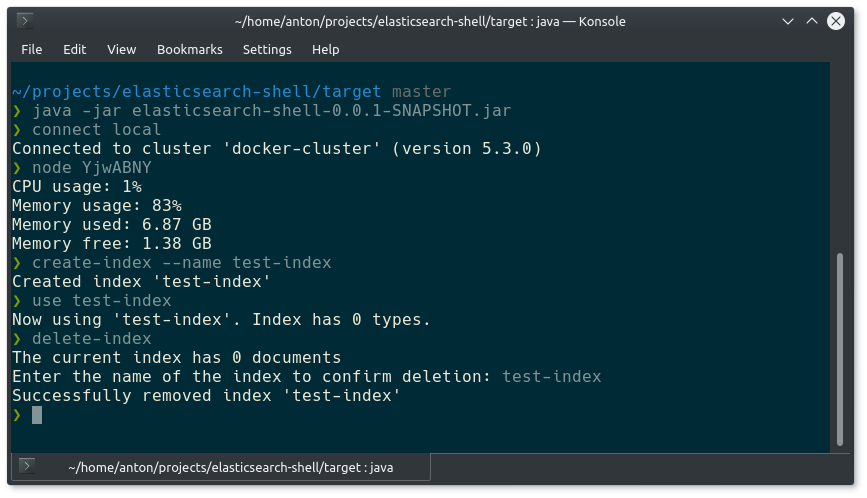

# elasticsearch-shell

[](https://travis-ci.org/anton-johansson/elasticsearch-shell)
[](https://codecov.io/gh/anton-johansson/elasticsearch-shell)
[](https://raw.githubusercontent.com/anton-johansson/elasticsearch-shell/master/LICENSE)

Provides a shell for managing Elasticsearch instances.



## Features

 * Show cluster health
 * Show node information
 * Handle multiple connections
 * Session management
 * Create indices
 * Delete indices


## Install

### dpkg

```shell
$ https://github.com/anton-johansson/elasticsearch-shell/releases/download/v1.0.0/elasticsearch-shell_1.0.0_all.deb
$ sudo dpkg --install elasticsearch-shell_1.0.0_all.deb
```

### npm

```shell
$ npm install --global elasticsearch-shell
```


## Build

```
mvn package
```


## License

Apache License © [Anton Johansson](https://github.com/anton-johansson)
